# Marker Motion X-Ray Imaging Phantom

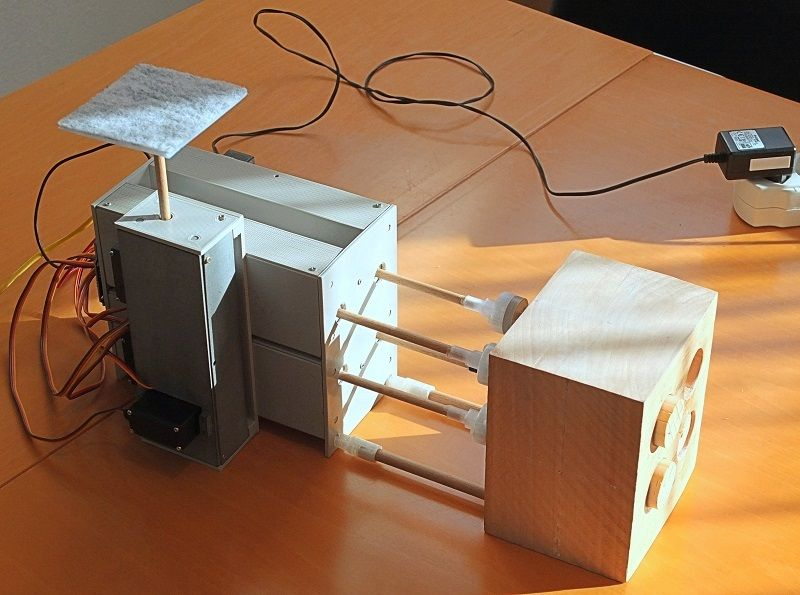

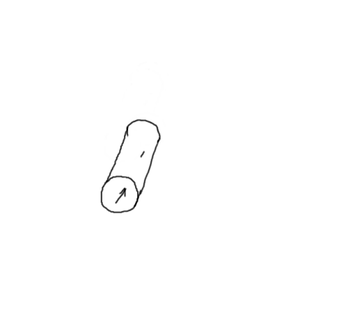

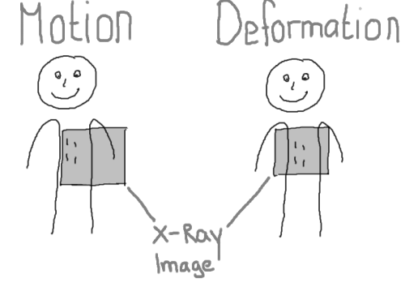

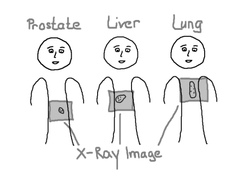

In medical imaging, motion is not wanted. You may know that if you  ever got a CT or MRI. You lay there, in horrible pains, on the MRI  scanner and after an hour or so, the therapist comes in and says: “*Please, do not move!*”. But that is a different story. This story is about an imaging phantom  that simulates motion in a human body. More precisely, it simulates [motion of marker implants](https://github.com/mrstefangrimm/GRIS5A/blob/master/Instructable/patientmotion.gif).

*“(An) imaging phantom […] is a specially designed object that is scanned or  imaged in the field of medical imaging to evaluate, analyze, and tune  the performance of various imaging devices.”*

Source:  [wikipedia](https://en.wikipedia.org/wiki/Imaging_phantom). There is also a [nice video on youtube](https://www.youtube.com/watch?v=6xDVQZrojcM).

Markers, or fiducial markers, are small, highly visible objects implanted in the patient’s body and used as “landmarks”.  Markers are implanted in  organs like the liver, the prostate, the pancreas or even the lung.  Markers in medical imaging are used to correlate images or to track  motion. 

Because these markers are easy to detect, there are  computer programs able to correlate images based on the implanted  markers or track the marker positions.

Markers implanted in the prostate, the liver or the lung lead to [different motion patterns](https://github.com/mrstefangrimm/GRIS5A/blob/master/Instructable/patientrespiratorygating.gif).

In a prostate, markers are implanted to correlate images. The markers do  not move during the image acquisition unless the patient moves. It is  possible that the markers slowly move over days which leads to different topologies. Markers in a liver move up and down with the respiratory  motion. Markers in the liver move as a group whereas in the lung, marker may move in different directions when the patient breathes.

Is it possible to build a imaging phantom that simulates markers implanted in a prostate, a liver  or the lung? Is it possible that this imaging  phantom is realistic enough to evaluate, analyze, and tune the  performance of various imaging devices?

Commercially available  motion phantoms are not specially built for marker motion patterns and  are more general purpose respiratory phantoms. To simulate realistic  marker motion, organ deformation and different marker topologies, each  marker has to be moved individually and in three dimensions. To achieve  that, each marker is placed on a wooden cylinder which itself is placed  in a cylindrical bore in a wooden block. By rotating and moving the  cylinders, the [markers individually move in three dimensions](https://github.com/mrstefangrimm/GRIS5A/blob/master/Instructable/markermotion3d.gif).

To drive the cylinders, this phantom uses four [LnR-Actuators](https://www.instructables.com/id/Linear-and-Rotation-Actuator/), an Arduino micro controller and an Adafruit Servo Shield. The micro  controller is required because you cannot be in the room when you  acquire X-Ray images. The Arduino is programmed with different motion  patterns. You start one of the motion patterns and leave the room before the irradiation starts.

Wood has not the same density (or  Hounsfield units) as human tissue. The HU value of wood is around -500  whereas human tissue is around 50 to 150 HU. This phantom is suitable to evaluate and tune the performance of a medical device but not for  Imaging Dosimetry. The used electronic devices are not tested for rad  hardness which means the lifetime is shortened when exposed to X-Ray. I  read a rad hard ATmegaS128 CPU cost around $3000; a new Arduino cost  $30.

### Supplies:

1 Arduino Uno

1 Adafruit 16-Channel Servo Shield

5 [LnR-Actuator](https://www.instructables.com/id/Linear-and-Rotation-Actuator/)

1 Wooden block (l/w/h) 100 x 120 x 180mm

4 wooden cylinders (d/l) 30 x 100 mm

4 metal marker (d/l) 1 x 3 mm

1 wooden rod with 8 mm diameter

1 wood rod with 6 mm diameter

Windows 10 x64 PC 

3D Printer, Standing drill and drills for wood: 30mm, 8mm and 6mm

## Step 1: Phantom Body

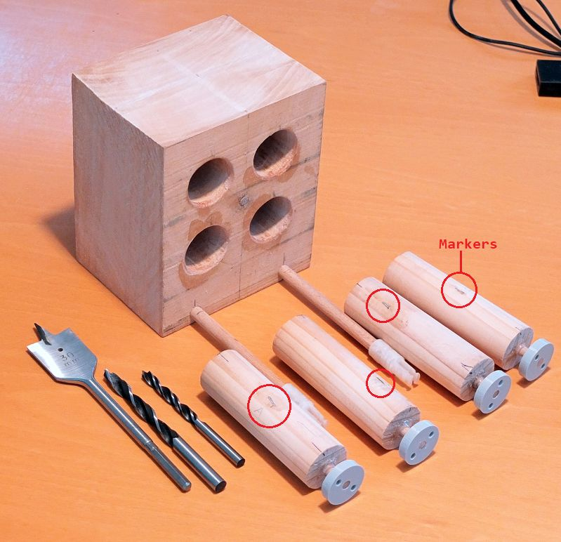

If you print the front plate from the next  step you have a template for where to put the holes in the wooden block. The four 30 mm holes build a square of 50 mm. I had no problems to bore these holes but I had to clean the walls with sand paper afterwards.

The two wooden rods (8 x 120 mm) are used to connect the wooden block to the actuator assembly and maintain the distance.

The four cylinders of 30 mm diameter have a flange with a wooden handle (6 x 20 mm). The flange needs a M4 inner thread.

## Step 2: Actuator Assembly

The LnR-Actuators have two round knobs on each side. The LnR-Actuators can simply be plugged into the front and the  back plate. To wooden rods (8 x 175 mm) which are screwed to the front  and back plate, pull and hold the actuator assembly together.

The flange is not directly glued to the rod of the LnR-Actuator so that it is possible to disassemble the device.

## Step 3: Gating Platform

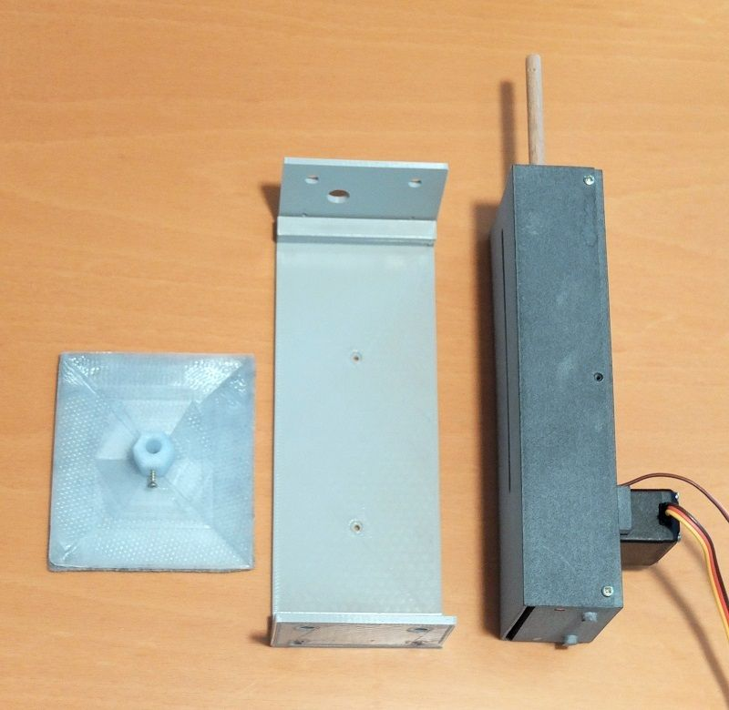

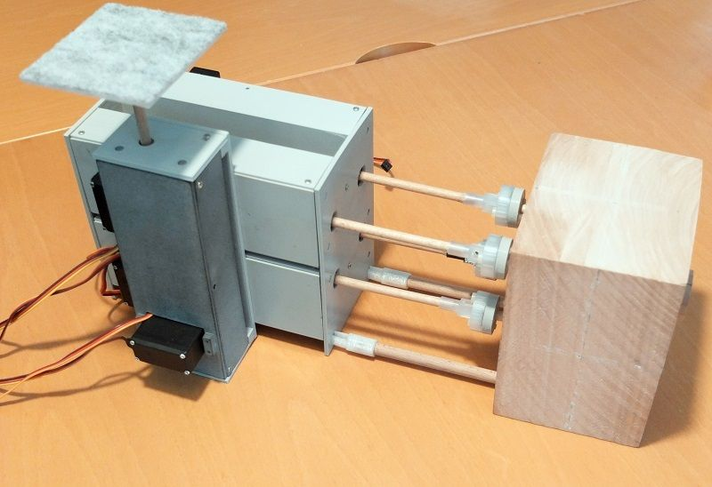

The gating platform is needed to simulate breathing motion in up/down  direction. The gating baseplate is screwed to the actuators with two M2 x 10 mm screws.

## Step 4: Micro Controller

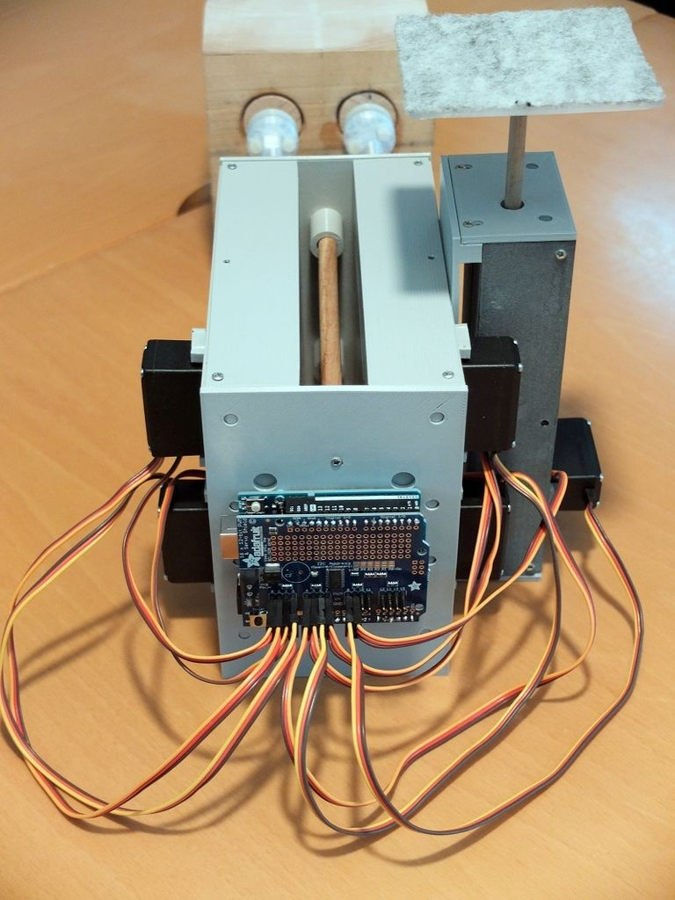

The control unit is an Arduino and an Adafruit Servo shield. Four distance rings prevent the micro controller board  from touching the back plate.

The order how to connect the servo  motors is as follows and must be maintained: LUR, LUL, LLR, LLL, RLL,  RLR, RUL, RUR, GAL, GAR.

LUR: Left Upper Rotary servo motor

RLL: Right Lower Longitudinal servo motor

GAL: Gating Longitudinal servo motor

and so on.

## Step 5: Software and Calibration

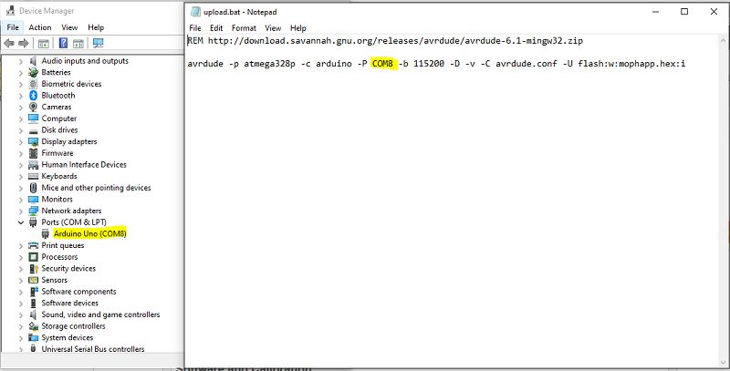

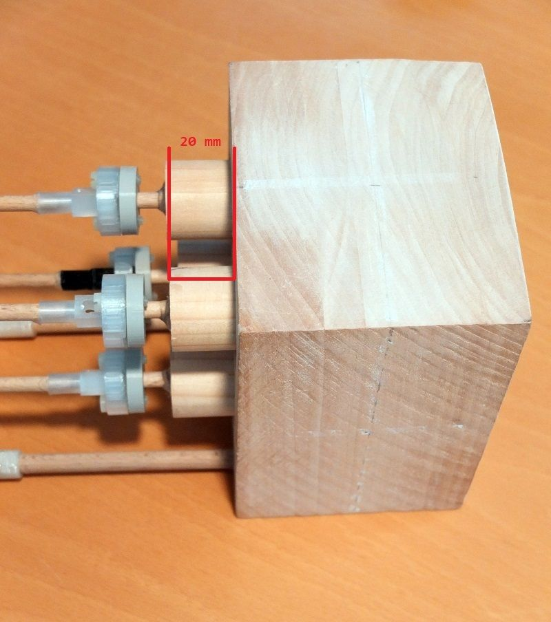

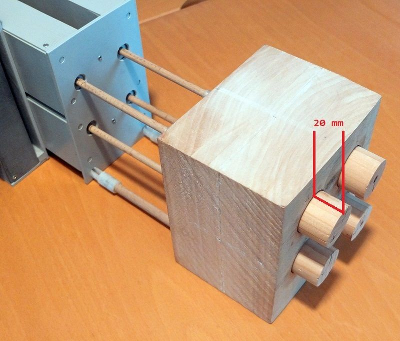

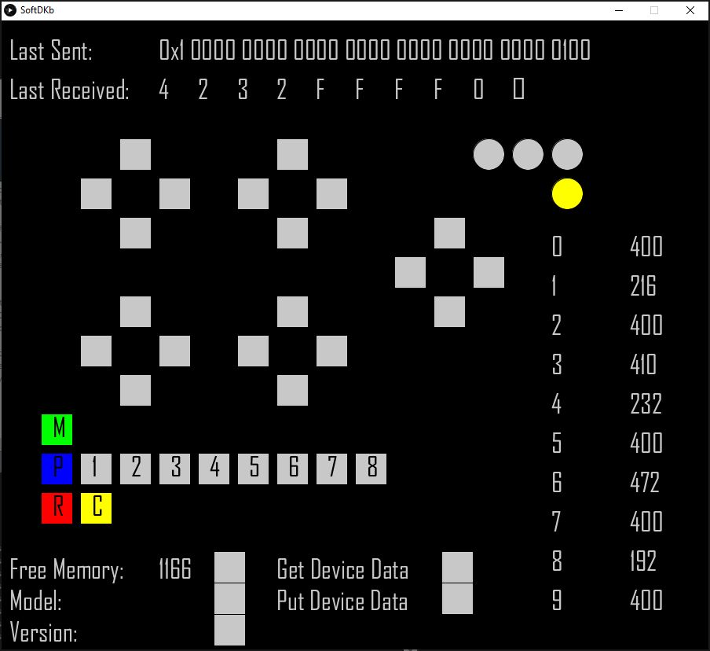

First you need to download these [binaries](https://github.com/mrstefangrimm/GRIS5A/blob/master/Instructable/MarkerMotionPhantom.zip). The compressed file contains the Arduino program mophapp.hex, avrdude  to upload it and a Windows application called SoftDKb.win64.exe.

To install the software on the Arduino, connect the phantom to your  computer and check the port in the Device Manager. Change the COM port  in the files "upload_mophapp.bat" and "start_softdkb.bat". To upload,  double-click the file "upload_mophapp.bat".

Start the application with the file "start_softdkb.bat". SoftDKB is the software version of the **d**edicated **k**ey**b**oard I will explain later. With the buttons that look like the buttons on a gamepad the motors can be moved.

When you start the application for the first time, the yellow bulb in the  upper right corner "lights up". Before you can use the phantom, the axes have to be calibrated. I briefly explain the required 2-point  calibration: First move the motor to the zero position and read the  value (e.g. -2 cm =>  1 : 470). Move motor to the full extended  position (e.g. +2 cm => 1: 216). The calibration values for this  motor are 470 and -0.9921875 ((216-470) / 256).

Evaluate the  calibration values for all the motors and replace the values in the file devicedata.txt with your own values. I know this is a bit a pain but it is inevitable. Click on "Put Device Data" and select your file. You are two clicks away from using the phantom!

## Step 6: Use the Phantom

https://youtu.be/l14pO0ekk0s

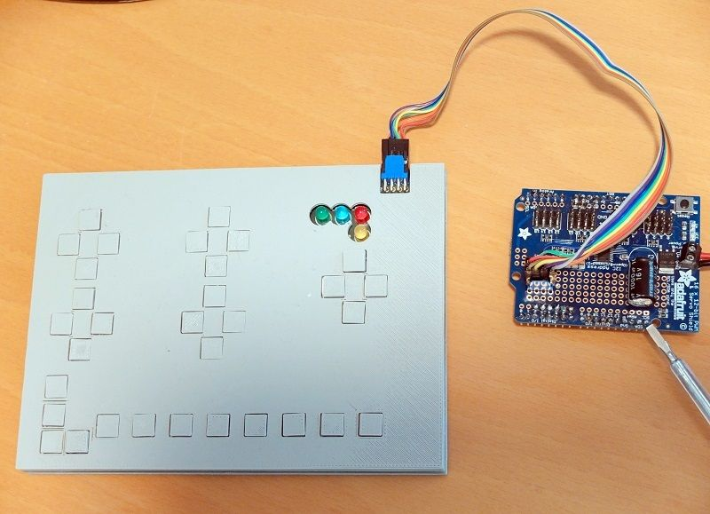

SoftDKb is a Java based application to control the phantom. It has its name and its look from the hardware version; the **D**edicated **K**ey**b**oard. The advantage of the DKb is that the USB port is not occupied.

The SoftDKb has far more functionality than the hardware version. It cannot only start the phantom, it is also used to calibrate the phantom and  get information on memory consumption and the software version.

The cylinders can be moved with the "arrow keys" in **M**anual mode. The buttons 1 - 8 are used to set the step size.

In **P**reset mode, the buttons 1 - 8 are used to start one of the stored motion  pattern. The "arrow keys" have no function in this mode.

In the **R**emote mode, the phantom can be controlled by other application such as the Virtual Marker Phantom.

## Step 7: ... and More

https://youtu.be/4L0OvpXcFAo

An imaging phantom is nothing you need at  home. Imaging phantoms are used in hospitals and in companies that build medical devices.

I would be surprised if anyone is interested to  build this device (this is my excuse for the short instructions :-)).  Please do not hesitate to leave a comment or contact me if you want more details on a specific subject.

In the movie, I use another  application I called the Virtual Marker Phantom. This application has  two "X-Ray views" where you can see how the markers move within the  wooden block. This application is not released yet.

