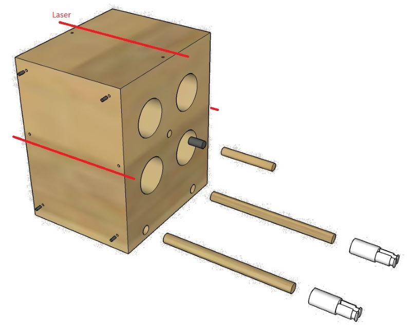
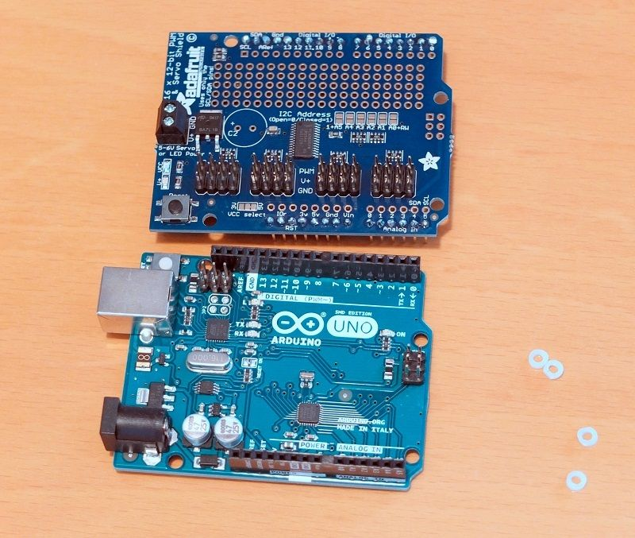
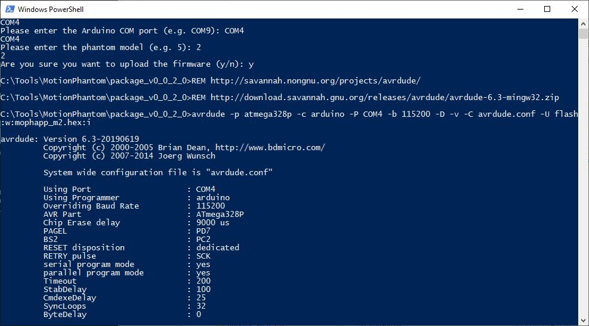

# Marker Motion X-Ray Imaging Phantom

https://youtu.be/TMkLDR-dig4
https://youtu.be/PLr7lDx5VoA
https://youtu.be/z_6X1krTg_E

In the field of medical imaging, so called imaging phantoms are used  to evaluate, analyze, and tune the performance of various imaging  devices (Source: Wikipedia). 

Markers, or fiducial markers, are small, highly visible objects implanted in the patient’s body and used as “landmarks”.  Markers are implanted in  organs like the liver, the prostate, the pancreas or even the lung.  Markers in medical imaging are used to correlate images or to track  motion. This specially developed imaging  phantom simulates marker motion based on respiratory motion.

The idea for this phantom came when I studied marker motion. In a prostate, markers are implanted to correlate images. The markers do  not move during the image acquisition unless the patient moves. It is  possible that the markers slowly move over days which leads to different topologies. Markers in a liver move up and down with the respiratory  motion. Markers in the liver move as a group whereas in the lung, marker may move in different directions when the patient breathes.

On an X-Ray image, the material and the density define what is a  bone, a liver or a lung. Wood for example is similar to a lung. The four freely movable cylinders are made of wood and are used to simulate motion of the markers. The metal markers have a much higher density (> 10000 times higher) than wood and are clearly visible on an X-Ray image.

This short animation demonstrates some motion patterns of the Marker Motion X-Ray Imaging Phantom in simulation and reality:
https://youtu.be/S2i1PQueZQw

To generate the motion, the phantom uses five [LnR-Actuators](https://www.instructables.com/id/Linear-and-Rotation-Actuator/), an Arduino micro controller and an Adafruit Servo Shield. The phantom can be remote controlled from a Windows PC or Android Device over an USB cable.

This phantom is suitable to evaluate and tune the performance of medical devices. A field of application could be the development of motion tracking and marker detection and matching algorithms. With the used materials, imaging dosimetry is not possible. 

The direct material costs are approximately USD 250.

### Supplies:

1 Arduino Uno

1 Adafruit 16-Channel Servo Shield

5 [LnR-Actuator](https://www.instructables.com/id/Linear-and-Rotation-Actuator/)

4 Metal marker d1 x l4 mm, created from paper clip

9 Screw M2 x l10

4 Screw M2 x l20

1 Wooden block l100 x w120 x h180 mm

4 Wooden cylinders  d30 x l100 mm

4 Wooden dowel d6 x l25 mm

1 Wooden dowel d6 x l42 mm

2 Wooden dowel d8 x l166 mm

2 Wooden dowel d8 x l110 mm

3 Graphite lead of a pencil d2 x l12 mm

8 Graphite lead of a pencil d2 x l5 mm

1 Windows PC with Java 8 runtime and .NET Framework 4.6.2

1 3D Printer

1 Standing drill and drills for wood: d30, d8, d6 and d2 mm

Legend: l:length, d:diameter, w: width, h:height

## Step 1: 3D Printed Parts

PLA, default 20% infill: Cmn-FlangeClip.stl, Cmn-FrontClip.stl, Cmn-GatingPlatform.stl, MMXIP-Back.stl, MMXIP-Flange.stl, MMXIP-FlangeCylinder.stl, MMXIP-Front.stl, MMXIP-GatingBase.stl, MMXIP-GatingBottom.stl, MMXIP-GatingTop.stl

## Step 2: Build the Phantom Body

The "phantom body" is the wooden cube as seen in the images above. It has 4 bores that allow the cylinders to rotate and move back and forth. In the center of the four cylinder bores is a 6 mm hole filled with graphite from a pencil lead (this is clearly visible on an x-ray and represents the target).

Markings on the sides and top of the phantom help align the phantom with the laser. On the left and right side are four pins made from a pencil lead as rigid markers visible on x-rays.

First, use a pencil to mark where you need to drill. The center of the 4 cylinder bores is at a height of 79 mm. the distance from cylinder to cylinder bore is 50 mm. The holes for the distance holders are at a height of 8 mm and the distance between them is 70 mm.

The depth of the center hole is 54 mm. It is filled with 12 mm  graphite closed with a wooden rod (42 mm). The depth for the 2 holes for the distance holders is 10 mm.

It is up to you where and if you want to add the graphite pins on the left and right side. However, the markings for the lasers should be on the same height as the target.

## Step 3: Assemble the four Cylinders

Cut a M4 thread into the two d3.3 mm holes in the *MMXIP-Flange*. Bore a hole of d6 x 6 mm diameter into the front of the cylinder. Insert a dowel d6 x 25 mm and add a *MMXIP-Flange*. Fixate it with some glue.

To add the markers at the correct, position, insert the cylinders into the phantom body and align the cylinders such that the flanges are horizontally. On each cylinder, make a mark with a pencil towards the center of the phantom and add the metal markers as shown on the picture in the step above.

## Step 4: Assemble the Actuator

To build the actuator assembly, fixate two wooden dowels d8 x l166 mm to the *MMXIP-Back* with two screws M2 x l20 mm. Plug-in the four LnR-Actuators and add the *MMXIP-Front*. Add a *Cmn-FlangeClip* to each of the LnR-Actuator shafts but do not fixate it yet.

Plug-in the assembled phantom body into the actuator assembly. First screw the *MMXIP-Flange* to the cylinders and use plastic screws M4 x l20 mm to fixated it. Connect the flange-clip with the flange. Align the cylinders and then fixate the flange clips with some glue to the actuator shafts.

## Step 5: Add the Gating Platform

To build the Gating assembly, add the *MMXIP-GatingBottom* and the *MMXIP-GatingTop* to the *MMXIP-GatingBase* with screws M2 x l10 mm and add it the the actuator assembly with two screws M2 x l10 mm. Add the *Cmn-GatingPlatform* and fixate it with a screw M2 x l10 mm.

## Step 6: Add the Micro Controller

Use four distance rings to prevent the micro controller board  from touching the back panel. Fixate the Arduino with four screws M2 x l10 mm on the *MMXIP-Back* and attach the Adafruit Servo Shield.

Connect the servos to the servo  shield in this order: Rotary (short cable) Lower, Upper, Gating. Longitudinal (long cable) Lower, Upper, Gating.

Connect the servos to the servo  shield in this order: LUR, LUL, LLR, LLL, RLL,  RLR, RUL, RUR, GAL, GAR.

LUR: Left Upper Rotary servo motor, LUL: Left Upper Longitudinal, LLR: Left Lower Rotary, ...,  RLL: Right Lower Longitudinal, GAL: GAting Longitudinal, ...

## Step 7: Install the Firmware and Calibrate

Download the package.zip (e.g. package_v0.0.2.0.zip) of the latest release from [github](https://github.com/mrstefangrimm/Phaso/releases/). The download includes the required scripts and the software to control the phantom. Unzip the package into a local folder, e.g. C:\Tools\MotionPhantom. 

Connect the phantom to your PC before the next steps.

In the download is a PowerShell script that uploads the firmware and write the calibration data to the EEPROM. To execute the script, open a PowerShell and change the directory to the target folder and then run: .\setup.ps1. Or right-click on the setup.ps1 and select Run with PowerShell.

- The script now lists one or more COM ports. Enter the phantom's port (e.g. COM13).

- For the model, enter: 3

- Confirm the firmware upload with: y

  The script uses avrdude to upload the firmware. After the upload, the firmware is active.

- Confirm the EEPROM update with: y

  The script writes the default calibration to the EEPROM.

- Confirm to run a test with: y

  The test ends with the output: Complete, and resets the firmware.

The phantom is ready for use.

## Step 8: Remote Control It With the Virtual Phantom Application

https://youtu.be/4L0OvpXcFAo

The Virtual Phantom Application is a .NET based application and part of the downloaded package (\Virms.NET\ViphApp.exe). The application simulates X-Ray imaging. And it is possible to connect and control a phantom with the application.

When you start the program, the Marker Phantom is already selected.

If the phantom is plugged-in, its port should in the list. Select the port and press "Connect".

On the right control panel, it is possible to either control the motion axes individually or start a program.

If you plan to write your on software: This programming interface is completely documented in this [Wiki](https://github.com/mrstefangrimm/Phaso/wiki).

## Step 9: Control It From Your Phone

https://youtu.be/MwSjcJiLyaM

](./installmophdroid.jpg)

MophDroid is a Android App that allows you to control the phantom from your phone. This App replaces the need to every time wire your PC to the phantom. Instead you may install the App on a discarded smartphone which you then leave connected to the phantom. Like this, the phantom is always ready for use.

To install the App you have to enable the developer options on your phone. Follow [these instructions](https://www.xda-developers.com/install-adb-windows-macos-linux/) to setup your phone and your PC.

