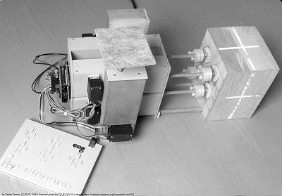

# Marker Motion X-Ray Imaging Phantom
GRIS5A (working title) is a motion phantom with 5 motion axes which are controlled independently for both linear and rotary motion.
The name "Gris" "5A" comes from its color (gray) and the 5 axes. 

## Project History
The project was launched in 2017 and has been added to github in 2018. In 2020, the software that is shared with other projects has been moved to its own repository named Phaso.

## Construction

A detailed description how to build this phantom is published on *[Instructables.com](https://www.instructables.com/id/Marker-Motion-X-Ray-Imaging-Phantom/)*.

## Manufacturing Tool Chain

### Mechanical Design

Tool | License 
---- | -------
SketchUp | SketchUp Shop 
Ultimaker Cura | GPL

### Hardware Design

Tool | License 
---- | -------
Fritzing | GPL

## License

This work is licensed under the Creative Commons Attribution-ShareAlike 4.0 International License. To view a copy of this license, visit http://creativecommons.org/licenses/by-sa/4.0/ or send a letter to Creative Commons, PO Box 1866, Mountain View, CA 94042, USA.
